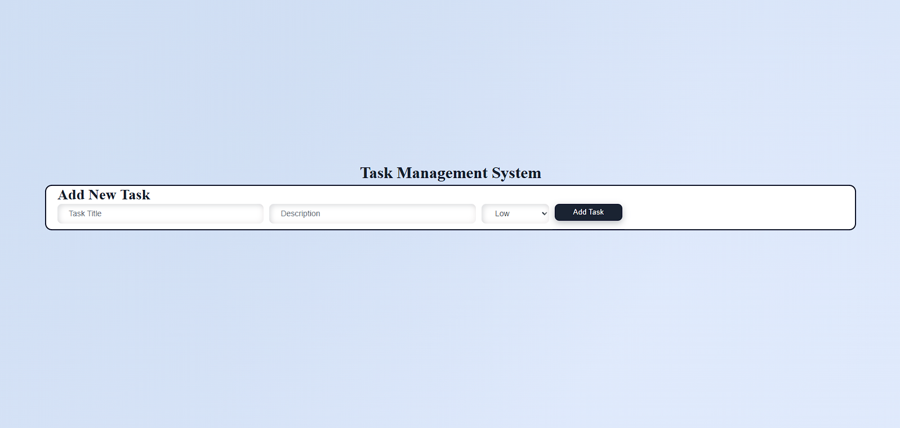
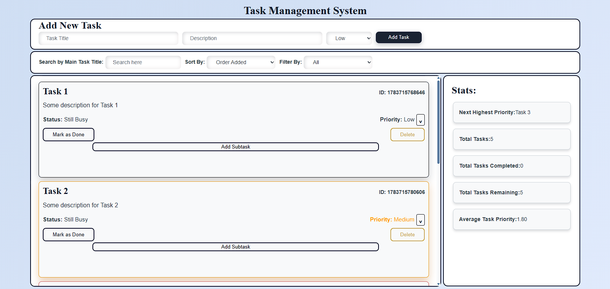
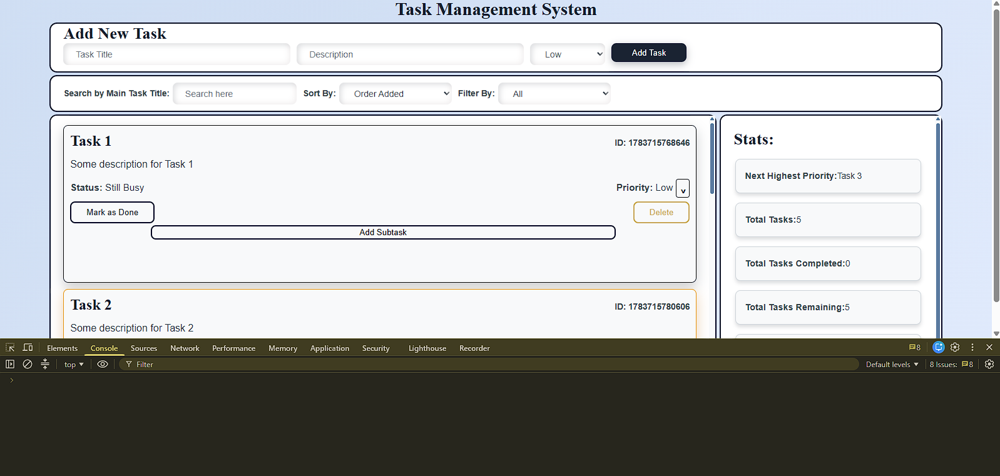
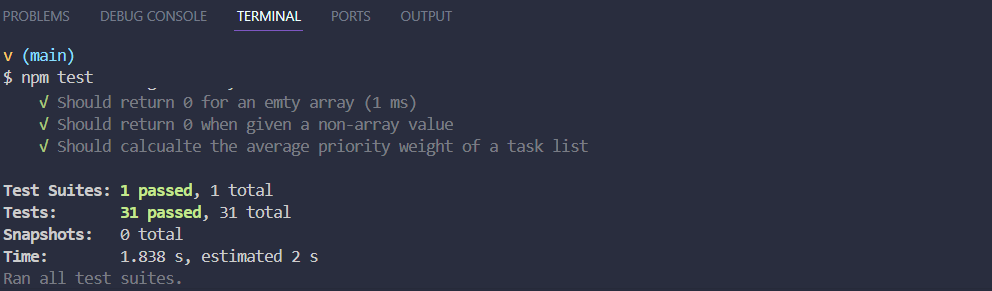
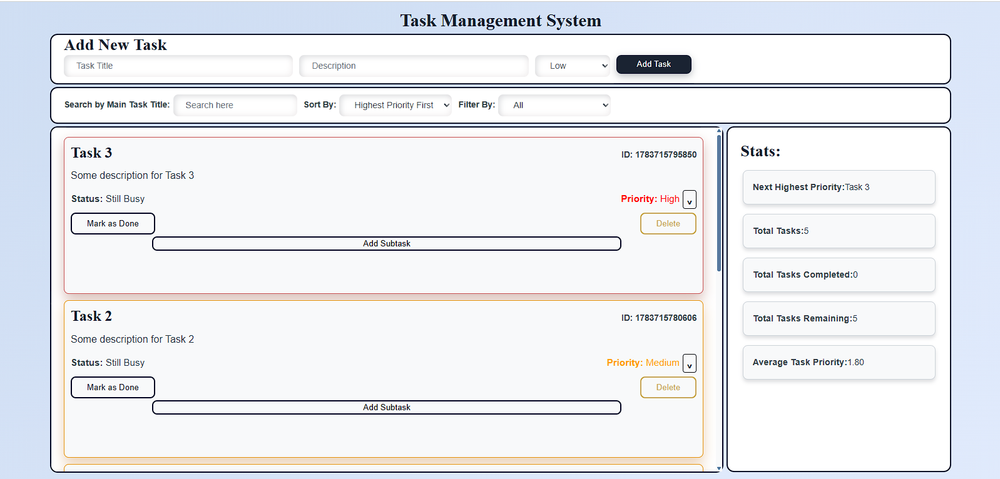
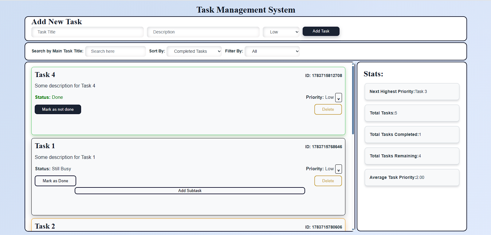
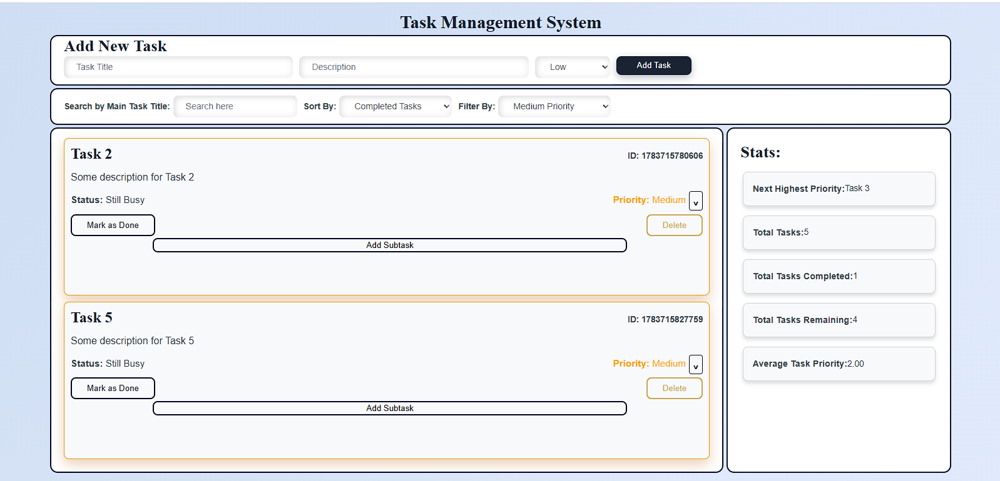
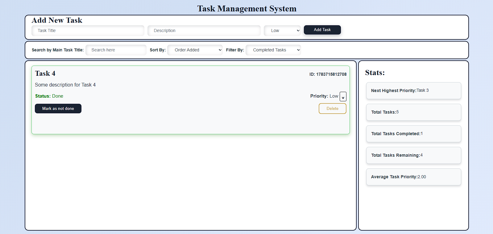
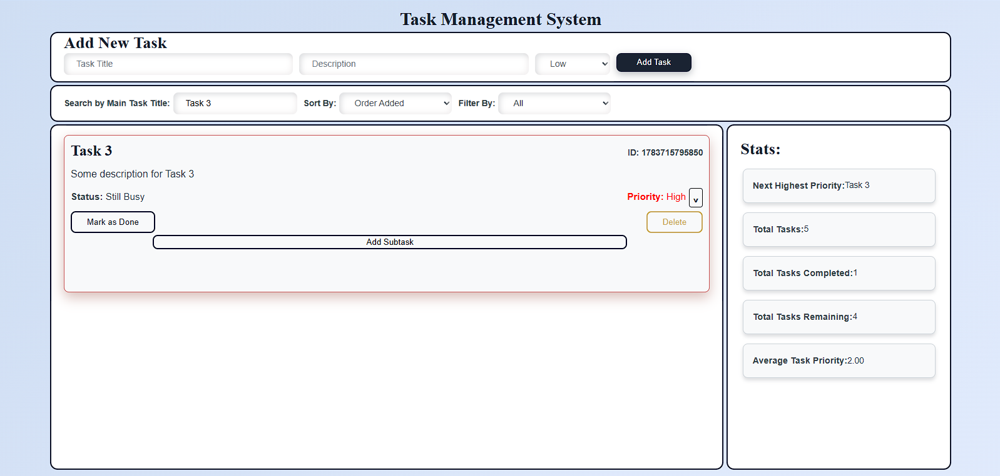

# Task Manager

This project is a Task Management App that is built using vanilla JavaScript, to demonstrate my understanding of ES6+ fundamentals such as, classes and inheritance, functional array methods, destructuring/spread/rest, DOM manipulation with event delegation, localStorage persistance, and Jest testing.

## Overview

In my application, Users can add tasks with a title, description and priority that can be altered after initialisation and also toggle completion. Under each task they can add a subtask that can be deleted or toggle completion. Filters like Sort, Search and Filter manages the task list according to what the user eants to see. The app also features live stats like total tasks, total completed tasks, average priority and more. All state is persisted to `localStorage` and reloaded on page load. The app is plit into three ES6 modules namely, `utilis.js`, `app.js` and `dom.js` plus a Jest test suite that covers the app's core logic.

## Errors Found (by category)

- **Variables/Operators (7):** `taskList` declared without `var`/`let`/`const`; `var` used throughout instead of `let`/`const`; `==` in `findTaskByTitle` and `isHighPriority`; `=` instead of `===` in `updateTaskPriority`; no `typeof` guards anywhere.
- **Control Flow (4):** off-by-one `for` loop (`<=` instead of `<`) in `displayAllTasks`; infinite `while` loop in `findTaskByTitle` (missing `i++`); no `for...of` loops anywhere; manual `for` loops used where array methods fit better.
- **Functions (7):** `findTaskByTitle` missing its `title` parameter entirely; `countCompletedTasks` recursion has no base case and no null/undefined guard; `getTaskDetails` manually copies properties instead of destructuring; `mergeTasks` manually loops instead of using spread; no pure functions or higher-order functions anywhere.
- **OOP (4):** `Task` missing `id` and a completion-toggle method; `SubTask` references `this` before calling `super()`, which throws in real JS; `TaskManager` has only one method (`getTotalTasks`).
- **Modern JS (4):** no destructuring, no template literals (string concatenation instead), no spread/rest usage anywhere in the file.
- **DOM (5):** `getElementById(".add-task-btn")` mixes ID and class selectors; `querySelector("task-input")` is missing its `#`; no null checks before attaching listeners; `setupEventListeners()` runs before `DOMContentLoaded`; no `preventDefault()` or event delegation.
- **Storage/Utils (4):** `saveToStorage`/`loadFromStorage` never call `JSON.stringify`/`JSON.parse`; `generateRandomId` uses raw `Math.random()` (decimal, collision-prone); `isHighPriority` returns `"yes"`/`"no"` strings instead of booleans; `utils.js` has no exports.
- **Testing (4):** no imports (every test throws before running); `var` in test bodies; no `beforeEach` reset; only 2 partial tests exist.
- **HTML/CSS (7):** scripts load `dom.js` before `app.js`; no `type="module"`; priority input missing from the form; CSS selectors (`#app`, `.task-form`, `.stats`) don't match the HTML's actual classes.

## Fixes Implemented

- Converted every `var` to `let`/`const`; replaced all `==`/`=` misuse with `===`.
- Fixed the off-by-one loop and the missing-increment infinite loop; introduced `for...of` loops in task iteration and priority updates.
- Added a base case and guard to `countCompletedTasks` so the recursion terminates correctly, including on an empty list.
- Added `id` and `toggleCompletion()` to `Task`; fixed `SubTask` (renamed `Subtask`) to call `super()` before touching `this`.
- Rebuilt `TaskManager` as a shared-state object with filtering, sorting, searching, subtask handling, and stats methods.
- Replaced string concatenation with template literals throughout `dom.js` and `app.js`.
- Added object and array destructuring, spread (`[...this.tasks]` for non-mutating copies), and rest parameters (`addMultipleTasks(...tasksData)`).
- Corrected DOM selectors, added null checks before every DOM operation, moved initialization inside `DOMContentLoaded`, and delegated click handling on the task list container instead of binding listeners per task.
- Implemented `JSON.stringify`/`JSON.parse` in `saveToStorage`/`loadFromStorage`, wrapped in `try/catch`; switched ID generation to `Date.now()`.
- Fixed `isHighPriority` to use `===` and return a real boolean.

## Features Added

- ES6 classes with inheritance (`Task` → `Subtask`)
- Functional array methods: `map`, `filter`, `reduce`, `find`
- A custom higher-order function (`withValidation`) and pure functions (`calculateAveragePriority`, `formatTaskName`, `isHighPriority`)
- Recursive completed-task counter with the correct base case
- Destructuring (object, array, and function-parameter forms), spread, and rest operators
- Event delegation for all task-card interactions (complete, delete, change priority, add subtask)
- `localStorage` persistence via `JSON.stringify`/`JSON.parse`
- 3 ES6 modules (`app.js`, `dom.js`, `utils.js`) with `import`/`export`

## Running the Application

1. Clone the repository and open `index.html` in a browser (or serve it with a local static server, e.g. `npx serve`).
2. Add a task using the form; toggle, filter, sort, search, and delete tasks from the list.

## Running the Tests

```bash
npm install
npm test
```

**Latest test run:** `Test Suites: 1 passed, 1 total` · `Tests: 31 passed, 31 total`

The test coverage includes: `Task` creation and methods, `Subtask` inheritance, `TaskManager` CRUD operations, recursive counting (including the empty-list edge case), filtering/sorting, and `calculateAveragePriority` (including empty-array and non-array edge cases).

## Screenshots

- `app-running.png` — application running in the browser
- `console-no-errors.png` — browser console with no errors
- `tests-passing.png` — `npm test` output showing 25/25 passing
- `dom-features.png` — filtering/sorting/subtasks working live

### Application running in the browser

#### With **no** tasks added



#### **With** tasks added



### Browser Console with no errors



### Output showing 31/31 tests passing



### filtering/sorting/subtasks working live

#### Sorting the tasks by **highest priority** first



#### Sorting the tasks by **completed tasks** first



#### Filtering the tasks by **medium priority**



#### Filtering the tasks by **completed tasks**



#### Searching for tasks by **title**



## Reflection

The trickiest bug was the recursive `countCompletedTasks` function — without a base case it would recurse past the end of the array and throw, so tracing the stack to find where `this.tasks[index]` became `undefined` was the key debugging step. The second challenge was untangling `TaskManager.tasks` as an alias for the exported `taskList` array: mutating one had to reliably mutate the other, which shaped how `removeTask` and the Jest `beforeEach` reset (`taskList.splice(0, taskList.length)`) were written.
